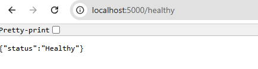

# test-fastapi-simple-app

This is a simple FastAPI app that will serve as an API end point for testing API Gateways such as Kong. 

```bash
git clone https://github.com/joseeden/test-fastapi-simple-app.git
cd test-fastapi-simple-app
pip install -r requirements.txt
python3 main.py
```

Output:

```bash
INFO:     Uvicorn running on http://localhost:5000 (Press CTRL+C to quit)
INFO:     Started reloader process [5367] using StatReload
INFO:     Started server process [5370]
INFO:     Waiting for application startup.
INFO:     Application startup complete 
```

## Testing 

Open a web browser and navigate to the endpoint:

```bash
http://localhost:5000/healthy 
```

It should return:




Checking the docs:

```bash
http://localhost:5000/docs
```


Back in the terminal, you should see the logs:

```bash
INFO:     127.0.0.1:57982 - "GET /healthy HTTP/1.1" 200 OK
INFO:     127.0.0.1:45662 - "GET /docs HTTP/1.1" 200 OK
INFO:     127.0.0.1:39750 - "GET /openapi.json HTTP/1.1" 200 OK
```